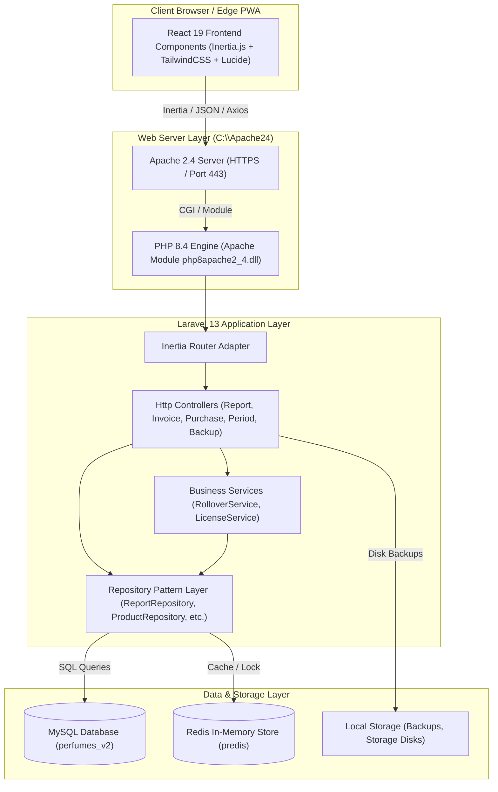
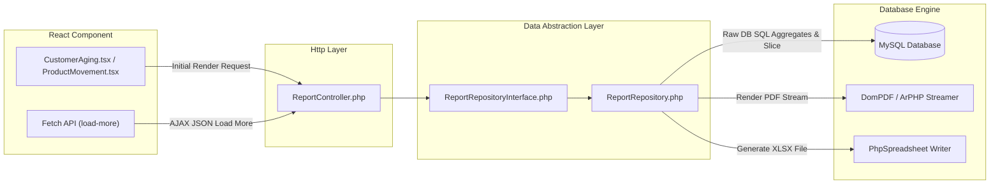
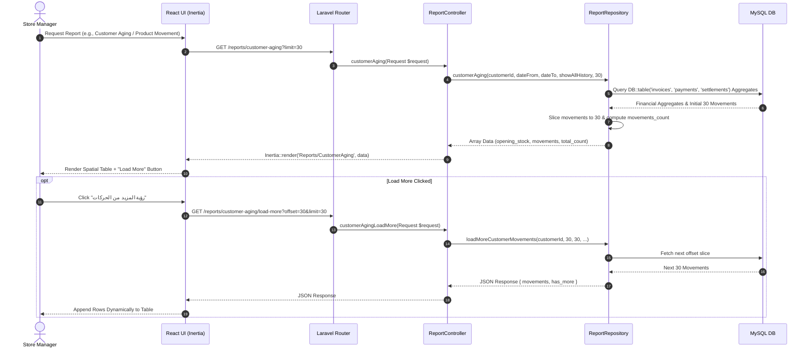

# 📊 C4 Architecture Model — Perfumes_v2

This document describes the architectural structure of **Perfumes_v2** using the C4 model specification (Context, Container, Component, Code).

---

## Level 1: System Context Diagram

The System Context diagram shows the high-level boundary of the Perfumes_v2 application, its actors, and external system integrations.

```mermaid
graph TD
    User["Store Manager / POS Operator / Super Admin"]
    System["Perfumes_v2 POS & Inventory ERP System (Laravel 13 + Inertia + React)"]
    MySQL[("MySQL 8.0 Database")]
    Redis[("Redis 7.0 Cache & Sessions")]
    ExternalPrinter["POS Barcode & Receipt Printers"]

    User -->|HTTP / HTTPS (SSL)| System
    System -->|Eloquent / SQL QueryBuilder| MySQL
    System -->|Cache / Sessions / Queues| Redis
    System -->|Thermal Print / Direct PDF| ExternalPrinter
```

### Context Entities
- **Users**: Super Admins, Administrators, Cashiers, and Inventory Staff accessing via browser or desktop PWA wrapper.
- **Perfumes_v2 System**: The primary ERP system handling sales, purchases, customer/supplier aging, inventory logs, waste tracking, accounting periods, and reporting.
- **MySQL Database**: Stores core entities, audit logs, accounting period snapshots, and transactions.
- **Redis Server**: High-speed memory store for session persistence (`SESSION_DRIVER=redis`), query caching (`CACHE_STORE=redis`), and background queue listeners (`QUEUE_CONNECTION=redis`).
- **External Hardware**: Thermal receipt printers, ESC/POS hardware, barcode scanners.

---

## Level 2: Container Diagram

The Container diagram illustrates the high-level technical building blocks that make up the system architecture.



---

## Level 3: Component Diagram (Reporting Subsystem)

The Component diagram breaks down the Reporting & Data Retrieval subsystem, highlighting repository abstraction and pagination mechanisms.



---

## Level 4: Code Diagram (Report Pagination Sequence)


