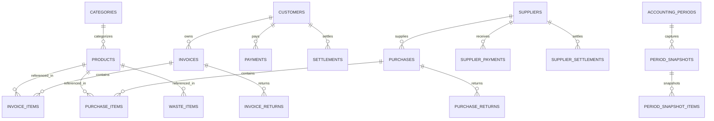

# 💾 Data Architecture & Persistence Model — Perfumes_v2

This document details the database architecture, entity-relationship structures, transaction management, accounting periods, and Redis caching topologies utilized in **Perfumes_v2**.

---

## 🗄️ Storage Engine Overview

- **Primary Relational Store**: MySQL 8.0 / MariaDB.
- **In-Memory Store**: Redis 7.0 (via `predis/predis` PHP client).
- **ORM / Query Abstraction**: Laravel Eloquent & Raw Query Builder (`DB::table(...)`).
- **Data Access Pattern**: Repository Pattern under `app/Repositories/`.

---

## 🔀 Entity Relationship Overview



---

## 📊 Core Domain Entities

| Entity Model | File Path | Table Name | Purpose |
| :--- | :--- | :--- | :--- |
| **Product** | [`app/Models/Product.php`](file:///c:/Users/alale/OneDrive/Desktop/work/Perfumes_v2/app/Models/Product.php) | `products` | Inventory items, stock levels, QR codes, categories |
| **Category** | [`app/Models/Category.php`](file:///c:/Users/alale/OneDrive/Desktop/work/Perfumes_v2/app/Models/Category.php) | `categories` | Product grouping and measurement units (ml, bottle, piece) |
| **Customer** | [`app/Models/Customer.php`](file:///c:/Users/alale/OneDrive/Desktop/work/Perfumes_v2/app/Models/Customer.php) | `customers` | Sales clients, credit limits, current balance |
| **Invoice** | [`app/Models/Invoice.php`](file:///c:/Users/alale/OneDrive/Desktop/work/Perfumes_v2/app/Models/Invoice.php) | `invoices` | Sales headers, payment status, totals, soft deletes |
| **InvoiceItem** | [`app/Models/InvoiceItem.php`](file:///c:/Users/alale/OneDrive/Desktop/work/Perfumes_v2/app/Models/InvoiceItem.php) | `invoice_items` | Sales line items, quantity, unit price, cost price |
| **Supplier** | [`app/Models/Supplier.php`](file:///c:/Users/alale/OneDrive/Desktop/work/Perfumes_v2/app/Models/Supplier.php) | `suppliers` | Vendors, purchase history, debt balances |
| **Purchase** | [`app/Models/Purchase.php`](file:///c:/Users/alale/OneDrive/Desktop/work/Perfumes_v2/app/Models/Purchase.php) | `purchases` | Purchase invoices, supplier bills, status |
| **WasteLog** | [`app/Models/WasteLog.php`](file:///c:/Users/alale/OneDrive/Desktop/work/Perfumes_v2/app/Models/WasteLog.php) | `waste_logs` | Inventory damage, expired, or spilled stock records |
| **AccountingPeriod** | [`app/Models/AccountingPeriod.php`](file:///c:/Users/alale/OneDrive/Desktop/work/Perfumes_v2/app/Models/AccountingPeriod.php) | `accounting_periods` | Period rollover, financial snapshot locking |
| **PeriodSnapshot** | [`app/Models/PeriodSnapshot.php`](file:///c:/Users/alale/OneDrive/Desktop/work/Perfumes_v2/app/Models/PeriodSnapshot.php) | `period_snapshots` | Historical snapshot totals for stock, debt, profit |

---

## ⚡ Redis In-Memory Architecture

Perfumes_v2 utilizes Redis for high-speed caching and concurrency:

```env
SESSION_DRIVER=redis
CACHE_STORE=redis
QUEUE_CONNECTION=redis
REDIS_CLIENT=predis
REDIS_HOST=127.0.0.1
REDIS_PORT=6379
```

- **Sessions (`SESSION_DRIVER=redis`)**: Eliminates session lock file bottlenecks and speeds up Inertia page transitions.
- **Cache Store (`CACHE_STORE=redis`)**: Caching dynamic calculations, dashboard metrics, and query results.
- **Queues (`QUEUE_CONNECTION=redis`)**: Asynchronous execution of notifications, backup creation, and report pre-computation.

---

## 📈 Accounting Period Rollover & Period Snapshots

The application supports accounting period rollovers managed by [`app/Services/RolloverService.php`](file:///c:/Users/alale/OneDrive/Desktop/work/Perfumes_v2/app/Services/RolloverService.php):
1. **Closing Period**: Captures exact inventory quantities, supplier balances, customer debts, and profit margins.
2. **Snapshot Persistence**: Saves records to `period_snapshots`, `period_snapshot_items`, `period_snapshot_stock_profits`, and `period_snapshot_daily_profits`.
3. **Opening Balance Transfer**: Automatically sets the opening balance for the subsequent financial period.
